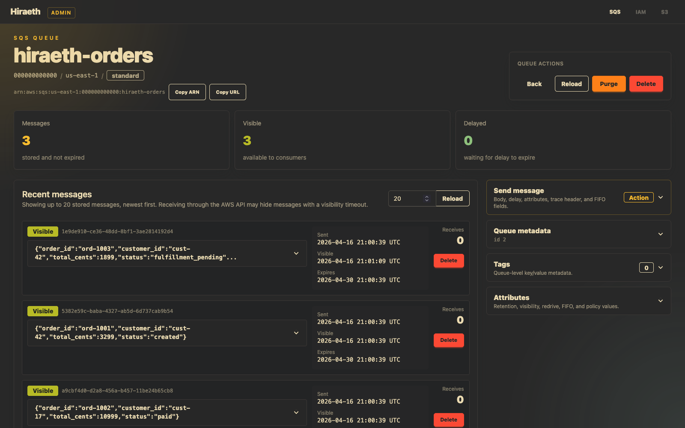

# Hiraeth

Hiraeth is a local AWS emulator focused on fast integration testing. The first
release target is SQS: signed AWS SDK requests go through a local HTTP endpoint,
state is stored in SQLite, and an optional web UI exposes the local emulator
state for debugging.



This project is early. It is intended for local development and test
environments, not as a production AWS replacement.

## Current Scope

- AWS SigV4 header authentication with a seeded local test credential.
- SQLite-backed principals, access keys, queues, messages, attributes, and tags.
- SQS-compatible endpoint for common queue and message operations.
- Web admin UI on a separate port for inspecting local emulator state.
- Docker and Docker Compose support.
- SQLx offline query metadata for checked SQL builds.

## Quickstart

Start Hiraeth with Docker Compose:

```sh
docker compose up --build
```

The AWS-compatible endpoint listens on `http://localhost:4566`. The admin UI
listens on `http://localhost:4567`.

The default seeded credential is:

```sh
export AWS_ACCESS_KEY_ID=test
export AWS_SECRET_ACCESS_KEY=test
export AWS_DEFAULT_REGION=us-east-1
```

Create and inspect a queue with the AWS CLI:

```sh
aws --endpoint-url http://localhost:4566 sqs create-queue --queue-name local-orders
aws --endpoint-url http://localhost:4566 sqs list-queues
aws --endpoint-url http://localhost:4566 sqs send-message \
  --queue-url http://localhost:4566/000000000000/local-orders \
  --message-body "hello from hiraeth"
aws --endpoint-url http://localhost:4566 sqs receive-message \
  --queue-url http://localhost:4566/000000000000/local-orders \
  --message-attribute-names All
```

Compose stores SQLite data in the named volume `hiraeth-data`.

## Container Image

Release images are published to GitHub Container Registry:

```sh
docker pull ghcr.io/sethpyle376/hiraeth:v0.1.0
```

Release maintainers can publish a multi-architecture image for `linux/amd64`
and `linux/arm64` from a local Docker Buildx environment:

```sh
docker login ghcr.io
scripts/publish-image.sh v0.1.0
```

The publish script pushes `ghcr.io/sethpyle376/hiraeth:<tag>`. Tags must match
the release format `v*.*.*`.

## Running From Source

```sh
mkdir -p .local
HIRAETH_DATABASE_URL=sqlite://.local/db.sqlite cargo run -p hiraeth_runtime
```

Defaults:

| Setting | Environment variable | Default |
| --- | --- | --- |
| AWS emulator host | `HIRAETH_HOST` | `0.0.0.0` |
| AWS emulator port | `HIRAETH_PORT` | `4566` |
| SQLite URL | `HIRAETH_DATABASE_URL` | `sqlite://data/db.sqlite` |
| Web UI enabled | `HIRAETH_WEB_ENABLED` | `true` |
| Web UI host | `HIRAETH_WEB_HOST` | `127.0.0.1` |
| Web UI port | `HIRAETH_WEB_PORT` | `4567` |

When running from source, prefer setting `HIRAETH_DATABASE_URL` to a path under
`.local/` or another directory that already exists.

## Web UI

The web UI is an admin/debug surface for local emulator state. It currently
supports SQS queue browsing, queue details, message inspection, attributes, tags,
purge, delete queue, and delete message.

The web UI does not use SigV4 authentication. Keep `HIRAETH_WEB_HOST` bound to a
trusted interface unless you intentionally want to expose local test state.

The current UI uses CDN-hosted Tailwind, DaisyUI, and htmx assets. A fully
self-contained/offline UI asset pipeline is still future work.

## SQS API Support

Status labels:

- `Supported`: implemented and covered by unit and/or AWS SDK integration tests.
- `Partial`: implemented, but known AWS edge behavior is incomplete.
- `Not implemented`: requests currently return `UnsupportedOperation`.

| API | Status | Notes |
| --- | --- | --- |
| `ChangeMessageVisibility` | Supported | Updates visibility timeout for a receipt handle. |
| `ChangeMessageVisibilityBatch` | Supported | Returns per-entry success/failure records. |
| `CreateQueue` | Partial | Supports attributes and tags. Queue validation exists, but AWS parity is not exhaustive. |
| `DeleteMessage` | Supported | Deletes by queue URL and receipt handle. |
| `DeleteMessageBatch` | Supported | Returns per-entry success/failure records. |
| `DeleteQueue` | Supported | Deletes queue and cascades stored messages/tags. |
| `GetQueueAttributes` | Supported | Supports the queue attributes modeled by Hiraeth. |
| `GetQueueUrl` | Supported | Supports owner account override. |
| `ListQueues` | Supported | Supports prefix, max results, and next token. |
| `ListQueueTags` | Supported | Returns stored queue tags. |
| `PurgeQueue` | Supported | Deletes stored messages for the queue. |
| `ReceiveMessage` | Partial | Supports max messages, visibility timeout, wait time polling, message attributes, and `AWSTraceHeader`. FIFO ordering semantics are not complete. |
| `SendMessage` | Partial | Supports body, delay, message attributes, system attributes, and FIFO metadata storage. Full FIFO deduplication semantics are not complete. |
| `SendMessageBatch` | Partial | Supports per-entry success/failure shape and message attributes. Full FIFO semantics are not complete. |
| `SetQueueAttributes` | Supported | Updates modeled queue attributes. Policy documents are stored, not enforced. |
| `TagQueue` | Supported | Upserts queue tags and enforces basic tag limits. |
| `UntagQueue` | Supported | Removes requested tag keys. |
| `AddPermission` | Not implemented | Authorization/IAM work is planned. |
| `CancelMessageMoveTask` | Not implemented | Redrive task APIs are out of scope for the first release. |
| `ListDeadLetterSourceQueues` | Not implemented | Redrive behavior is not complete yet. |
| `ListMessageMoveTasks` | Not implemented | Redrive task APIs are out of scope for the first release. |
| `RemovePermission` | Not implemented | Authorization/IAM work is planned. |
| `StartMessageMoveTask` | Not implemented | Redrive task APIs are out of scope for the first release. |

## Known Gaps

- IAM and queue policy enforcement are not implemented yet.
- Error responses are SDK-compatible for common paths, but not exhaustively
  identical to AWS.
- Request validation is pragmatic and still needs a deeper AWS parity pass.
- FIFO behavior stores FIFO fields, but does not yet fully model ordering,
  deduplication windows, or throughput behavior.
- The web UI is a local admin preview and is not authenticated.

## AI Usage

AI tools are used as part of this project's development workflow for code
generation, refactoring, test writing, documentation drafts, and design
discussion.

Most runtime code has been written by hand, most test code has been generated.
Regardless, all changes are reviewed, edited, and accepted by a human maintainer,
and the project relies on normal engineering checks such as tests, SQLx query
checking, and manual review rather than treating AI output as authoritative.

## License

Hiraeth is licensed under the [MIT License](LICENSE).

## Development

Format and test:

```sh
cargo fmt
cargo test
```

Prepare the local database used by SQLx query checking:

```sh
cargo run -p xtask -- prepare-db
```

Refresh SQLx offline metadata:

```sh
DATABASE_URL=sqlite://.local/db.sqlite cargo sqlx prepare --workspace -- --all-targets
```

Check SQLx metadata in CI-style mode:

```sh
DATABASE_URL=sqlite://.local/db.sqlite cargo sqlx prepare --workspace --check -- --all-targets
```

The checked SQL metadata under `.sqlx/` should be committed when queries or
migrations change.
